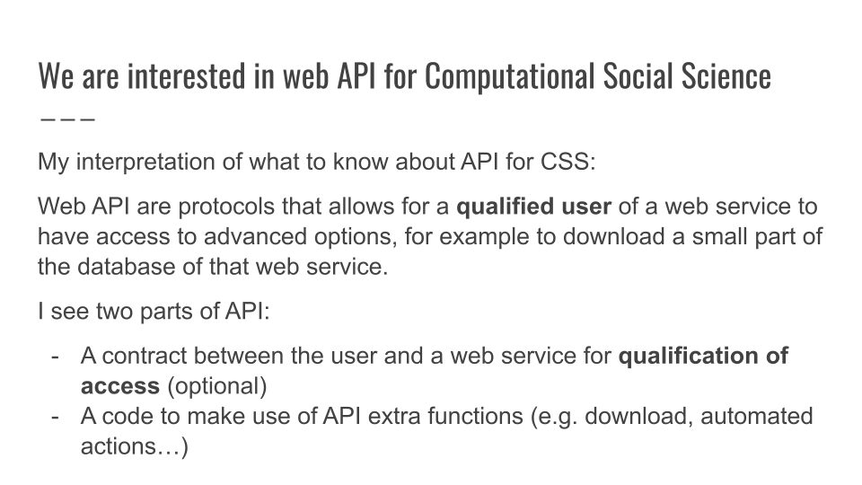

APIs and Twitter
================


What is an API and why Computational Social Scientists use API?



API is first and foremost a source of observational data.

-   Advanced use: to “upload” and automate.

------------------------------------------------------------------------

Before digging into API and Twitter, let’s explore the concept of

### R Packages that allow to connect and download observational data

First of all, let be sure that “pacman” is installed in your library.
With pacman we will install and activate some useful packages

``` r
pacman::p_load("owidR",
               "gutenbergr",
               "academictwitteR")
```

[Our World in Data](https://ourworldindata.org/) is a repository for
demographic and socio-economical data.

It has only few functions. The fastest way to explore all of them is to
digit `owidR::` in a script or within a chunk.

The fast way to use the package `owidR` is in two steps.

-   STEP 1: run the function `owid_search("")` with the “empty string”
    argument:

``` r
owid_search("") %>% View()
```

You can than filter results with the Filter of R Studio. Once some
datasets interest you, copy-paste the `chart id` value.

-   STEP 2: retrive the dataset with the function
    `owid_search("[chart id]")`, with the specific value that you
    selected

``` r
owid("pupil-teacher-ratio-for-primary-education-by-country") -> Education
```

------------------------------------------------------------------------

## Project Gutenberg is cool to download old books. Let’s look at the tible structure of these.

With this code we are going to count how many book per language are
stored in [Project Gutenberg](https://www.gutenberg.org/)

``` r
pacman::p_load(tidyverse)
gutenberg_metadata %>%
  group_by(language) %>%
  count()
```

    ## # A tibble: 103 x 2
    ## # Groups:   language [103]
    ##    language     n
    ##    <chr>    <int>
    ##  1 af           4
    ##  2 ale/en       1
    ##  3 ang/de       1
    ##  4 ang/en       3
    ##  5 ar           1
    ##  6 arp          2
    ##  7 bg           6
    ##  8 bgi/es       1
    ##  9 br           1
    ## 10 ca          28
    ## # ... with 93 more rows

The catalogue can be filtered with `tidyverse` functions.

``` r
gutenberg_metadata %>%
  filter(language == "it",
         title %>% str_detect("Sicil")
         )
```

    ## # A tibble: 7 x 8
    ##   gutenberg_id title    author gutenberg_autho~ language gutenberg_books~ rights
    ##          <int> <chr>    <chr>             <int> <chr>    <chr>            <chr> 
    ## 1        22506 "Le tre~ Sangi~            25368 it       IT Romanzi       Publi~
    ## 2        29409 "La gue~ Amari~            33895 it       IT Storia        Publi~
    ## 3        30984 "Gli av~ Colaj~            34935 it       IT Scienze poli~ Publi~
    ## 4        42649 "Avveni~ Pitrè~            39005 it       IT Folklore      Publi~
    ## 5        46887 "Storia~ Amari~            33895 it       IT Storia        Publi~
    ## 6        46888 "Storia~ Amari~            33895 it       IT Storia        Publi~
    ## 7        47114 "La gue~ Amari~            33895 it       IT Storia        Publi~
    ## # ... with 1 more variable: has_text <lgl>

`gutemberg_id` is the field of values to set as argument for downloading
the whole book.

``` r
gutenberg_download(30984) -> Sicilia
```

    ## Determining mirror for Project Gutenberg from http://www.gutenberg.org/robot/harvest

    ## Using mirror http://aleph.gutenberg.org

This book needs to be cleansed!

``` r
Sicilia %>% select(text)
```

    ## # A tibble: 16,343 x 1
    ##    text                      
    ##    <chr>                     
    ##  1 "D.r NAPOLEONE COLAJANNI" 
    ##  2 ""                        
    ##  3 "_Deputato al Parlamento_"
    ##  4 ""                        
    ##  5 ""                        
    ##  6 "GLI"                     
    ##  7 ""                        
    ##  8 "AVVENIMENTI DI SICILIA"  
    ##  9 ""                        
    ## 10 "E"                       
    ## # ... with 16,333 more rows

Usually books in **English** come already cleansed, in **other
languages** not.

------------------------------------------------------------------------

Napoleone Colajanni (1847 - 1921): Sicilian sociologist.

He wrote about crime and racism and was a rival to Cesare Lombroso.

------------------------------------------------------------------------

# TWITTER API

-   On the History of Twitter API

All you need to know is that historically there are two different
protocols to access to Twitter API

-   API 1
-   API 2, for academics

API 2 are newer and generally they are better.

Again, since we are academics that aim to get API 2, we will use
\`academictwitteR’. [Intro to
it](https://cran.r-project.org/web/packages/academictwitteR/vignettes/academictwitteR-intro.html).

\`academictwitteR’ is a API Wrapper for R. It’s a re-phrased coding of
an API to make it more user-friendly.

API and API Wrappers are like “jacks” that allow to stream data sharing
between a platform and qualified user in an alternative way,


------------------------------------------------------------------------

# The most important part that is not usually covered in any guide is this:

You have to setup a callback URL. What does it mean in theory? I don’t
know. In practice, you have to set the addresss `http://127.0.0.1:1410`
(that should be R Studio, not clear to me) in your App Settings in your
Twitter Programmer Account Portal.

------------------------------------------------------------------------

# AcademicTwitter, our friendly API Wrapper

Let’s look at how \`academictwitteR’ are structured.

There are 4 main functions that you want to know for sure:

-   `academictwitteR::get_all_tweets`: download all the tweets related
    to a topic (NOTE: it seems to me that the topic is not just a
    “token” but really an ontological concept) in a timeframe

-   `academictwitteR::get_user_timeline`: download last 3.200 tweets
    from a user. (This is actually deprecated, I will explain this
    concept in the class)

-   `academictwitteR::get_user_following` and
    `academictwitteR::get_user_followers` are quite self-explanatory

------------------------------------------------------------------------

Let’s look the structure of a `get_all_tweets()` query:

``` r
academictwitteR::get_all_tweets(
  query # Here goes your topic of interest. 
  bearer_token = , # This is a personal password, you need API 2 for this
  start_tweets = , # Time frame... a pain in the ankle to put it down...
  end_tweets = ,
  n = 500, # Why 500???
) -> My_collection
```

Focus your attention on `bearer_token`. This argument is a “password”
that allows to connect your R Studio to your qualified for API 2
account.

So:

-   Not all Twitter accounts have a `bearer_token`.
-   All Twitter accounts authorized for API 2 can self-generate a
    password that works as `bearer_token`.
-   The password is not sufficient alone to scrape! You need to both
    generate a password and also to setup your account correctly for the
    scraping activities.

------------------------------------------------------------------------

3 steps are necessary for using making work the `bearer_token` with
`academictwitteR`.

-   0 Having a Twitter Account
-   1
    [Request](https://developer.twitter.com/en/portal/petition/essential/basic-info)
    Academic Twitter API 2. This should allow you to download 1 Million
    tweets per month.
-   2 Setup the account correctly
-   3 Generate the token password and put it in the query function.

|                                                                        |
|------------------------------------------------------------------------|
| ACTUALLY!                                                              |
| There are two ways to connect your R Studio with your Twitter Account. |

-   One is to put it in the argument in the query. This is good if you
    want to switch between different monthly stocks of downloadable
    tweets.
-   The other is to use the command `set_bearer` and follow exactly the
    instructions.

------------------------------------------------------------------------

Scraping tweets from an account. I will pick Joe Biden (I could pick
more than one account).

``` r
pacman::p_load(academictwitteR)
academictwitteR::get_user_tweets(
  "JoeBiden",
  start_tweets = "2022-05-01T00:00:00Z",
  end_tweets = "2022-05-02T00:00:00Z",
  n=500
) -> JB
```

``` r
get_user_id("JoeBiden") %>% get_user_following() -> JBfollwing0
```
