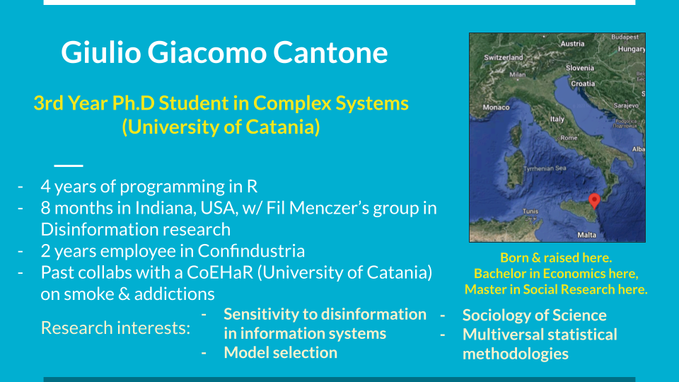

This is the repository for the materials of [SICCS Bologna 2022](https://sicss.io/2022/bologna/) for the classes held by Giulio Giacomo Cantone.



The schedule for the classes is:

- Tuesday 7 June 2PM: API and Twitter
- Wedsnday 8 June 2PM: Web scraping with rvest
- Thursday 9 June 2PM: How to perform tidytext

Each lesson is programmed to last 1 hr.
Students are encouraged to stay for 30 mins. more to discuss advanced details of the scheduled topics.

Examples of in-depth details:

- What are regular expressions for text cleansing?
- How to automate scraping of multiple pages?
- Why sentiment analysis is a week tool and how to improve its reliability?

[The reference book for tidytext is this](https://www.tidytextmining.com/).

---

# Important

Please download the package "pacman".

```{r eval=FALSE}
install.packages("pacman")
```

